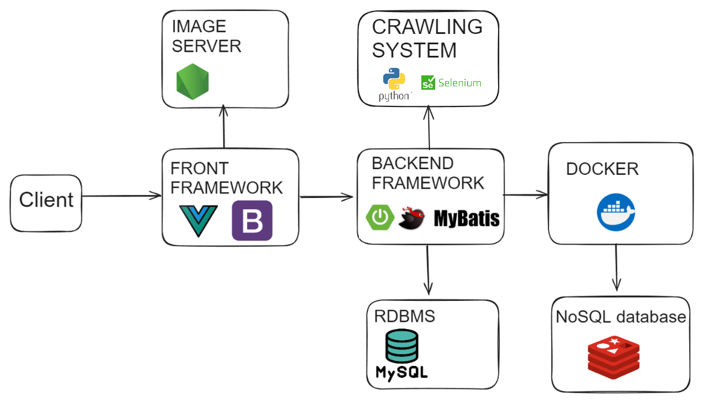

## gif의 로딩이 느릴 수 있습니다

# 1. 기획 의도

유튜브 채널 등 요즘에는 많은 사람들이 시청하는 컨텐츠가 굉장히 많다.

이러한 시대에 어떤 유튜버, 인플루언서들이 어떠한 가게, 관광지 등에 방문했는지 궁금해 하는 사람들이 많다.

관광지와 해당 관광지를 방문한 인플루언서를 결합하여 한눈에  볼 수 있는 서비스를  제공하는 서비스를 구축하면 많은 사람들에게 도움이 될것이라 생각하여 기획하였다.

동시에 인플루언서 랭킹을 구현하여 사람들이 어떤 인플루언서에 관심이 많은지도 알 수 있게 하였다.

__ __ __ __ __ __ __

# 2. 아키텍쳐

- SpringBoot를 이용하여 백엔드를 구축
- MyBatis를 RDBMS로 이용하고 Mybatis를 이용하여 Mapping
- Vue3로 SPA구축. Bootstrap5로 디자인.
- Redis를 이용하여 인플루언서 랭킹 시스템 구현. Docker환경에서 작동
- Node.js의 express 라이브러리 이용하여 이미지 서버 구현
- Python과 셀레니움을 이용하여 크롤링

## GPT활용 및 크롤링

__ __ __ __ __ __ __

# 3. 유즈케이스 및 다이어그램

[유즈케이스]

[클래스 다이어그램]

[DB 스키마]

__ __ __ __ __ __ __

# 4. 기능 구현

## 0. 메인 페이지

- 인플루언서의 랭킹 기능을 메인페이지에서 제공합니다.
- 실제 서비스에서 사용하는 관광지 이미지중 몇가지를 랜덤으로 보여줍니다.
- 공지 게시판 글을 최신순으로 3개까지 보여주며 클릭할 시 바로 게시글로 이동 가능합니다.

## 1. 맴버 기능 (기본기능)

- 회원가입 페이지를 구현했습니다. 글자수제한을 지키지 않거나 중복된 아이디를 사용할경우 회원가입을 진행할 수 없습니다.

- 로그인 기능입니다. 로그인을 실행할 경우 jwt토큰을 받아옵니다.
- 회원 정보를 확인하고 수정할 수 있습니다.

- JWT 기간이 만료되었을 경우 알림을 주며 로그아웃됩니다.

## 2. 게시판(QNA) 기능(기본 기능)

- 게시글에 대한 페이징과 게시글 조회 기능을 제공합니다.

- 관리자 계정으로 접속할 경우 공지를 추가할 수 있습니다.
- 사진을 첨부할 수 있습니다.

- 게시글 수정 삭제 기능을 구현하였습니다.

## 3. 지도 페이지(기본, 추가, 심화기능)

- 드래그를 이용하여 마커를 지도에 여행지들을 찾아볼 수 있습니다. 드래그가 끝남과 동시에 지도 화면의 중심을 기준으로 정보들을 업데이트 합니다.
- 음식점, 관광지 등 분류에 대한 필터링이 가능합니다.
- 시와 구,군을 이용하여 검색도 할 수 있습니다.
- 맵을 넓게 했을 경우 클러스터링을 제공합니다.

- 나타나는 마커들에 대한 정보를 card형태로 제공합니다.
- card 리스트를 무한 스크롤을 통해 제공합니다.
- 마커나 카드의 버튼을 클릭할 경우 상세 정보를 볼 수 있습니다,

- 인플루언서 이름과 이미지 등을 동시에 제공합니다.
- 인플루언서 별로 방문한 관광지를 표시할 수 있습니다.
- 인플루언서 마커를 제공합니다.
- 팔로우한 인플루언서 필터링, 검색어 필터링을 제공합니다.
- 해당 관광지를 인플루언서가 방문한적이 있다면 해당 방문 영상 정보를 제공합니다.

## 4. 인플루언서 기능

- 인플루언서를 모아서 볼 수 있는 페이지를 구성하였습니다.
- 인플루언서 검색, 팔로우가 가능합니다

- 사용자가 직접 인플루언서 추가를 요청할 수 있는 페이지를 만들었습니다.

- 관리자 계정으로 로그인 할 경우 인플루언서 추가 요청에 대한 승락 거절을 할 수 있는 관리 페이지가 활성화 됩니다.

## 5. 업로드 알람 기능

- 사용자가 팔로우한 인플루언서에 대한 방문정보가 추가될 경우 알람을 보냅니다.
- 사용자는 알람을 읽음처리, 삭제 할 수 있습니다.
- 알람을 클릭하여 해당 방문 정보를 볼 수 있도록 페이지를 연결합니다.

## 6. 리뷰 기능

- 관광지에 대한 리뷰를 작성할 수 있습니다.
- 이미지를 첨부할 수 있습니다.
- 평점 기능을 제공합니다.
